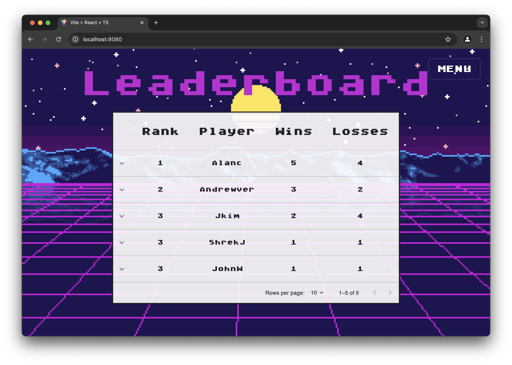
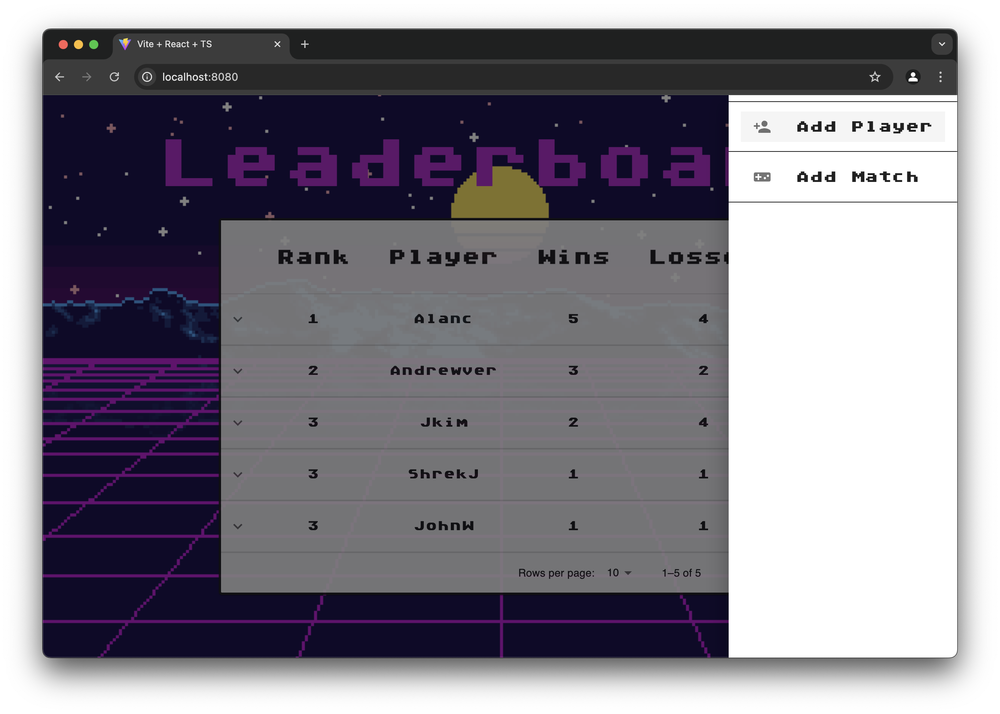
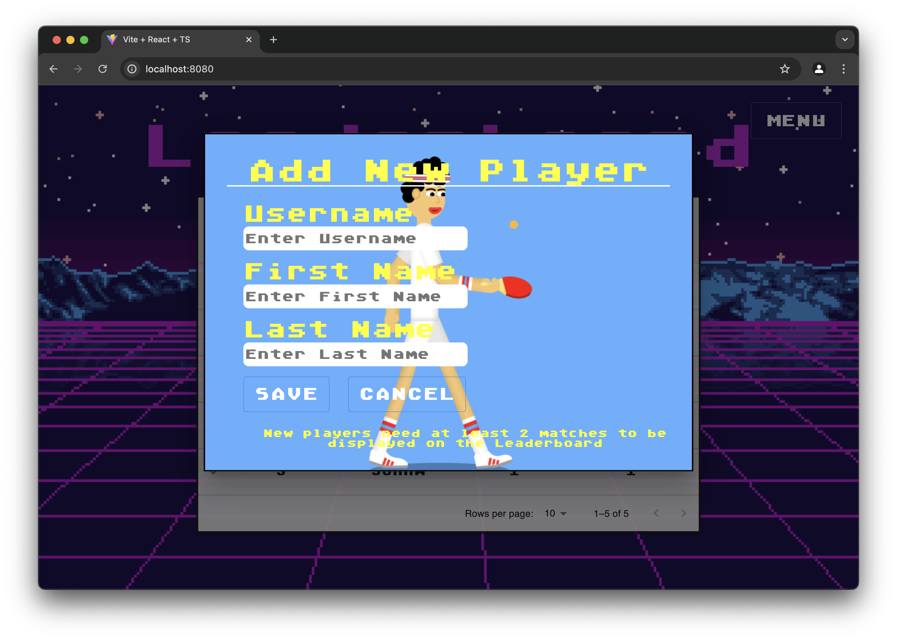
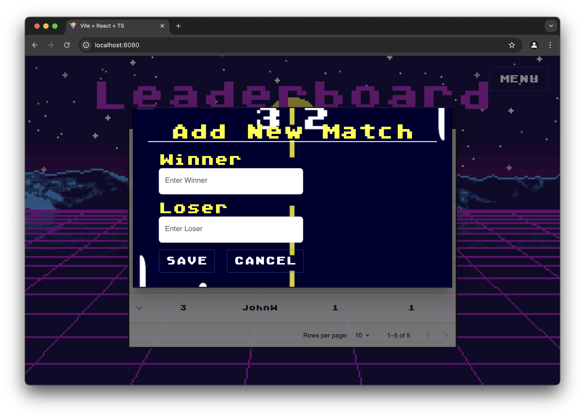
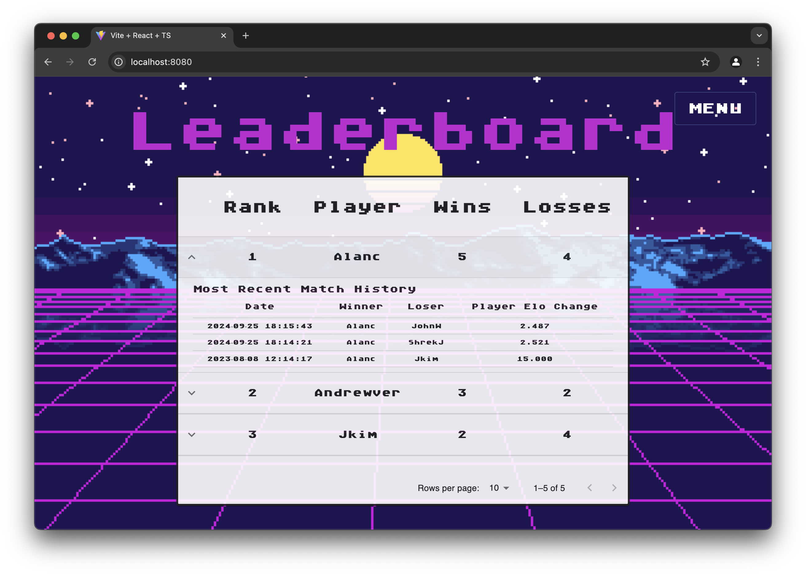

# Ping Pong Leaderboard
## Developer: Justin Kim

A full-stack web application that allows users to track ping pong match results and view player rankings powered by the [Elo rating system](https://en.wikipedia.org/wiki/Elo_rating_system). Users can create accounts, log matches against other players, and climb the leaderboard as they win games.

## Features

- Create and manage user accounts
- Log match results
- Real-time Elo rating updates after every match
- Dynamic leaderboard based on player performance
- Modern responsive UI with MUI and TypeScript
- Spring Boot backend with PostgreSQL integration
- Frontend built with Vite and served from the backend

---

## Why this Project?
This project was created as a fun and engaging way to apply full-stack development skills using modern frameworks and tools. It also served as a capstone-style project to demonstrate concepts like REST APIs, authentication, frontend-backend integration, and database design. Plus, who doesn’t love a bit of competitive ping pong?

---

## Tech Stack

### Backend
- **Spring Boot** (RESTful API)
- **Gradle** (Build Tool)
- **PostgreSQL** (Database)
- **Spring Data JPA**
- **Spring Security**

### Frontend
- **React + Vite**
- **TypeScript**
- **MUI (Material UI)**
- **React Router DOM**
- **ESLint + Prettier**

---

## Setup Instructions

### Step 1: Clone the repository
```bash
git clone https://github.com/justincyk/Ping-Pong-Leaderboard.git
cd Ping-Pong-Leaderboard
```

### Step 2: Configure the Database
   1. Ensure PostgreSQL is running on port 5433 (not the default 5432), or adjust the port in your Spring Boot configuration accordingly.
      - Option: Update application.properties
         - If your PostgreSQL server is running on a different port (e.g., the default 5432), update the following file in `src/main/resources/application.properties` to reflect the port.
         - Change 5433 in this line: `spring.datasource.url=jdbc:postgresql://localhost:5433/pingpong` according to your port.
   2. Make a database in PostgreSQL called pingpong using the pingpong.sql file in the repo.
   3. Edit the `src/main/resources/application.properties` to reflect your username and password.
       ```bash
       spring.datasource.username=your_username
       spring.datasource.password=your_password
       ```

### Step 3: Build and run the Project
   1. In the root type and enter: `./gradlew bootRun`
      - This will run the following Gradle tasks:
         1. Install frontend dependencies.
         2. Build the frontend.
         3. Copy frontend build artifacts into the backend's static resources.
         4. Launch the Spring Boot server on port 8080.
   2. The full app (frontend + backend) is served on `http://localhost:8080`

---

### Demo

#### Ping Pong Leaderboard Homepage


#### Sidebar Features


#### Add New Player


#### Add New Match


#### Toggle Player to See Match History
